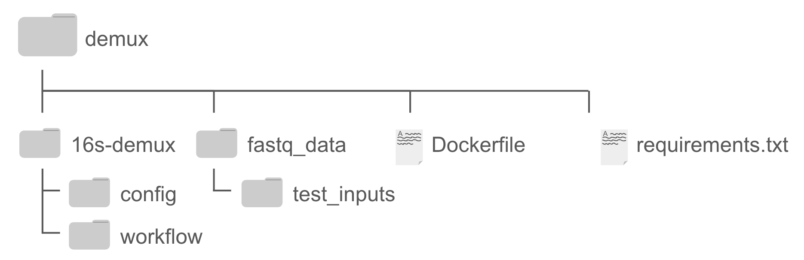
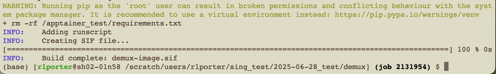

# Getting Started

This guide walks through setting up a container image, running the test analysis, and processing your own data.

## Prerequisites

- **Docker** ([install](https://docs.docker.com/engine/install/)) or **Singularity/Apptainer** (available on most HPC systems)
- At least **4 GB RAM** allocated to the container
- Paired-end sequencing data as `.fastq.gz` files

---

## Step 1: Obtain the Container Image

=== "Docker"

    ### Pull from Docker Hub (Recommended)

    Launch Docker, then run:

    ```bash
    docker pull rlporter24/dualindex-demux:1.0
    ```

    This downloads the pre-built image containing all code, dependencies, and test data.

    ??? info "Advanced: Build from Dockerfile"

        If you prefer to build the image yourself, download `docker-demux.zip` from the Zenodo repository and unzip it. The file structure should look like:

        

        `Dockerfile` and `requirements.txt` are needed for the build. The `fastq_data` directory contains test data, and all analysis code lives in `16s-demux/`.

        Build the image:

        ```bash
        docker build -t {name}:{version} .
        ```

        Replace `{name}:{version}` with your desired image name and version tag. The build takes a few minutes. A successful build ends with output like:

        

        !!! warning
            Building requires more resources than a typical HPC login node provides. Use a compute node or allocate sufficient resources through a job manager.

=== "Singularity/Apptainer"

    ### Build from Definition File

    Download `demux.zip` from the Zenodo repository and unzip it. The file structure should look like:

    

    `16s-demux.def` and `requirements.txt` are needed for the build. The `fastq_data` directory contains test data, and all code lives in `16s-demux/`.

    Navigate to the directory containing `16s-demux.def` and build:

    ```bash
    singularity build demux-image.sif 16s-demux.def
    ```

    The build takes less than 10 minutes. A successful build ends with output like:

    

    The file `demux-image.sif` will be created in your current working directory.

    !!! warning
        Building requires more resources than a typical HPC login node provides. Use a compute node or a job manager. A template Slurm script (`slurmBuild.sh`) is included in `demux.zip` — edit the SBATCH parameters for your system.

---

## Step 2: Run the Test Analysis

Run the included test data to verify your setup works correctly.

=== "Docker"

    Start an interactive container:

    ```bash
    docker run -it rlporter24/dualindex-demux:1.0
    ```

    !!! note
        If you built your own image, replace `rlporter24/dualindex-demux:1.0` with the `{name}:{version}` you used.

    All test files are included in the container. Run the test:

    ```bash
    snakemake --cores 1 -s test_Snakefile
    ```

    Replace `1` with the desired number of cores. This should complete in under 5 minutes.

=== "Singularity/Apptainer"

    **Interactive mode:**

    Open a shell in the container:

    ```bash
    singularity shell demux-image.sif
    ```

    Run the test from the `16s-demux` directory:

    ```bash
    snakemake --cores 1 -s test_Snakefile
    ```

    **Using a job manager (e.g., Slurm):**

    Edit the included `submit_test_snakemake.sh` script for your system, then submit it. The script runs:

    ```bash
    singularity exec ../demux-image.sif snakemake --cores 1 -s test_Snakefile
    ```

    Replace `1` with the desired number of cores. This should complete in about 10 minutes.

### Verifying Test Output

A successful test run produces output like:


Within `workflow/test_out/`, you should see `demux` and `trimmed` directories:

- **`demux/`** — four sets of 3 files (1 `.extract.log` + 2 `.fastq.gz` each), plus `R1/` and `R2/` directories. Each sample should have 8 files ending with `-L*.fastq.gz` (phases 0–7):

    

- **`trimmed/`** — subdirectories `group1` and `group2`, each containing `R1/`, `R2/`, `removed/`, plus `lowReadsSummary.txt` and `summary.txt`:

    

!!! success
    If all these files are present, the test run was successful.

---

## Step 3: Run Your Analysis

=== "Docker"

    **1. Start a container:**

    ```bash
    docker run -it rlporter24/dualindex-demux:1.0
    ```

    **2. Copy input files into the container:**

    From a separate terminal, use `docker cp` to transfer your data:

    ```bash
    docker cp {local_path} {CONTAINER}:{container_path}
    ```

    - `{local_path}` — path to a file or directory on your machine
    - `{CONTAINER}` — the container name (find it with `docker container ls`)
    - `{container_path}` — destination path relative to the `16s-demux` directory

    !!! tip
        Find your container name by running `docker container ls` or checking the Docker Desktop GUI.

    **3. Update configuration:**

    Edit `config/config.yaml` to set the paths for your `samplesheet`, `fastqlist`, and (if needed) `indices` file. See the [Configuration](configuration.md) page for details.

    **4. Dry run (recommended):**

    ```bash
    snakemake -n
    ```

    This validates inputs and shows planned jobs without executing them.

    **5. Execute:**

    ```bash
    snakemake --cores 1
    ```

    Replace `1` with the desired number of cores. A successful run ends with:

    

    **6. Transfer outputs:**

    ```bash
    docker cp {CONTAINER}:/16s-demux/workflow/out/ {local_path}
    ```

    **7. Clean up:**

    Exit the container (`exit`), then remove it:

    ```bash
    docker rm {container_name}
    ```

    !!! warning
        This removes the container and all data inside it. Make sure all outputs are transferred before removing.

=== "Singularity/Apptainer"

    **1. Prepare inputs:**

    Ensure your input files (fastq data, fastqlist, samplesheet) are accessible on the file system. Update `config/config.yaml` with the correct paths. See the [Configuration](configuration.md) page for details.

    **2. Dry run (recommended):**

    === "Interactive"

        ```bash
        singularity shell demux-image.sif
        snakemake -n
        ```

    === "Job Manager"

        Submit a job that runs:

        ```bash
        singularity exec ../demux-image.sif snakemake -n
        ```

    **3. Execute:**

    === "Interactive"

        ```bash
        snakemake --cores 1
        ```

    === "Job Manager"

        Edit the included `submit_snakemake.sh` script with your SBATCH parameters, then submit. The script runs:

        ```bash
        singularity exec ../demux-image.sif snakemake --cores 1
        ```

    Replace `1` with the desired number of cores. A successful run ends with:

    

    Outputs are generated in `workflow/out/`. To exit an interactive shell, type `exit`.

    !!! note
        Running interactively is only recommended for testing or troubleshooting. Login nodes typically lack sufficient resources — use a compute node or job manager for real analyses.
